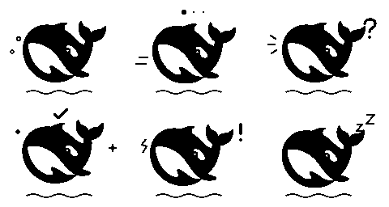

# DeepSeek 鲸鱼

基于用户提供的 `source/deepseek.svg` 制作，保留鲸鱼轮廓，以浮动、气泡、摇摆和状态符号适配 160×128 单色屏。

## 内容

六种状态各 8 帧，共 48 张透明 PNG；另有三段 0.4 秒 PCM WAV 音效。`pet.json` 可由现有 CLI 直接校验、安装，无需修改固件。

| 状态 | 表现 | 播放 |
| --- | --- | --- |
| idle | 水面浮动、上升气泡 | 200ms/帧，循环 |
| working | 游动、思考圆点 | 200ms/帧，循环 |
| waiting_input | 摇摆、问号及提醒线 | 200ms/帧，循环；可播放提示音 |
| success | 跃起、星光和完成标记 | 200ms/帧，循环；可播放完成音 |
| error | 摇动、感叹号 | 200ms/帧，结束后停留；可播放错误音 |
| stale | 缓慢下沉、睡眠符号 | 350ms/帧，结束后停留 |

音效按现有协议由 Agent 的 `sound=true` 请求触发；不会随画面循环。

## 预览与安装

在项目根目录运行，设备地址替换为屏幕 IP：

```sh
rlcd pet preview deepseek-whale
rlcd --device http://DEVICE_IP pet install deepseek-whale
rlcd --device http://DEVICE_IP pet use deepseek-whale
rlcd --device http://DEVICE_IP showcase --sound
```

随包提供 `preview/overview.png` 和六个状态 GIF。总览顺序为 idle、working、waiting_input、success、error、stale。



## 修改与复现

直接修改 PNG 和 pet.json 即可制作变体，完整规范见 [宠物素材指南](../../docs/pet-format.md)。若要从 SVG 重新生成，需要 uv 和 librsvg 提供的 `rsvg-convert`：

```sh
uv run scripts/create_deepseek_whale.py
rlcd pet preview pets/deepseek-whale --output pets/deepseek-whale/preview
```

生成脚本会覆盖本包的帧、音效和 pet.json；手工修改前建议复制为新的素材包。

参考 SVG 来自用户提供的文件，原始文件一并保留；其品牌图形权利属于相应权利人，本项目未为原图另行授予许可。动画编排、状态符号和合成音效由本项目生成。本素材包并非 DeepSeek 官方发行。
