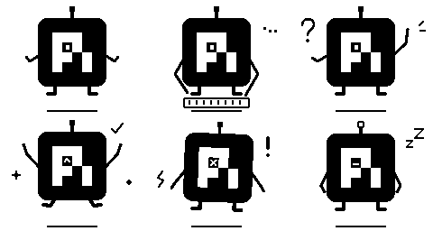

# Pi 方块机器人

基于用户提供的 Pi Coding Agent `source/favicon.svg` 设计。保留原 Logo 的圆角方形外壳和阶梯形白色符号，将符号内的方孔转成独眼，增加短机械臂、天线与脚。

素材包含六种状态各八帧，共 48 张 160×128 透明 PNG，以及三段 PCM WAV 音效。动画无需修改固件，可直接安装。

| 状态 | 动作 |
| --- | --- |
| idle | 轻微浮动，眼睛观察和眨动 |
| working | 双手机械臂敲键盘，处理指示点闪动 |
| waiting_input | 举手挥动，出现问号和提醒线 |
| success | 跳跃举手，星光与完成标记 |
| error | 短暂抖动，眼睛变成叉号，结束后停留 |
| stale | 降低身姿，天线灯熄灭，眼睛闭合 |

前五种状态 200ms/帧，stale 为 350ms/帧；error/stale 播放一次，其余循环。固件 0.6.0 在 idle/success 超过待机延迟或 TTL 到期时转入系统时钟待机页，不继续播放此处的 stale 动画；该素材保留以兼容状态格式。

waiting_input、success、error 可播放相应短音效，须在状态上报中加 `--sound`；不随动画重复。

## 使用

素材位于本机 `~/.config/rlcd/pets/pi-bot` 时可直接按 id 调用；从源码目录使用时也可显式传入 `./pets/pi-bot`。

```sh
rlcd pet preview pi-bot
rlcd pet install pi-bot
rlcd send working --agent pi --task coding --pet pi-bot --title '正在编写代码'
rlcd send waiting_input --agent pi --task coding --pet pi-bot --title '需要你的确认' --sound
```

如果要将其设为重启后默认选择，使用 `rlcd pet use pi-bot`。上报中的 `--pet` 仅临时切换。



`preview/` 包含六个动画 GIF，总览从左到右、从上到下为 idle、working、waiting_input、success、error、stale。

## 修改与来源

直接修改 PNG 与 pet.json 即可派生新宠物。需要从矢量 Logo 重新生成时，在源码根目录执行（需要 librsvg 的 rsvg-convert）：

```sh
uv run scripts/create_pi_bot.py
rlcd pet preview ./pets/pi-bot --output pets/pi-bot/preview
```

生成脚本会覆盖本包的图片、音效与 pet.json；手工调整前建议复制为新素材包。

原 SVG 由用户提供，原始文件随包保存，其品牌图形权利属于相应权利人；未为原 Logo 另行授予许可。机器人外形扩展、动画编排和合成音效由本项目生成，本素材并非 Pi Coding Agent 官方发行。

完整格式见 [宠物素材规范](../../docs/pet-format.md)。
